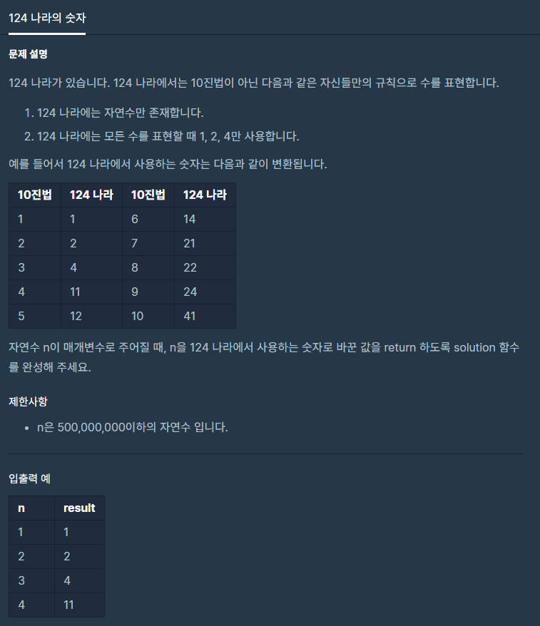

# 124나라의숫자

출처 : 프로그래머스

https://programmers.co.kr/learn/courses/30/lessons/12899?language=python3



```python
def solution(n):
    rule_dict = {
    1: '1',
    2: '2',
    0: '4',

    }
    # print(rule_dict)
    answer = ''
    print('n값 : ', n)
    while n > 0:

        nmg = n % 3
        n -= 1
        n = n // 3
        # if mok < 3:
        #     answer += rule_dict[mok]
        answer = rule_dict[nmg] + answer

    return answer
```

