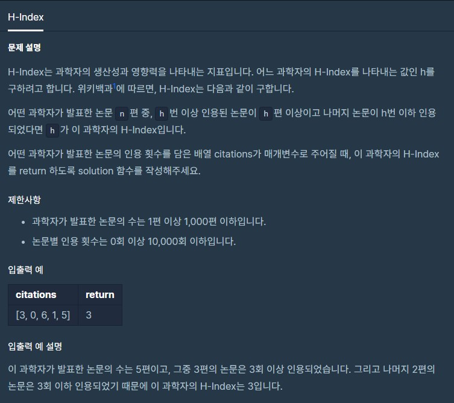

# H-Index

출처 : 프로그래머스

https://programmers.co.kr/learn/courses/30/lessons/42747



```python
def solution(citations):
    answer = 0
    for i in range(10000, 0, -1):
        cnt = 0
        nmg = 0
        for j in citations:
            if j >= i:
                cnt += 1
            else:
                nmg += 1

        if cnt >= i :
            answer = i
            break
    return answer
```

