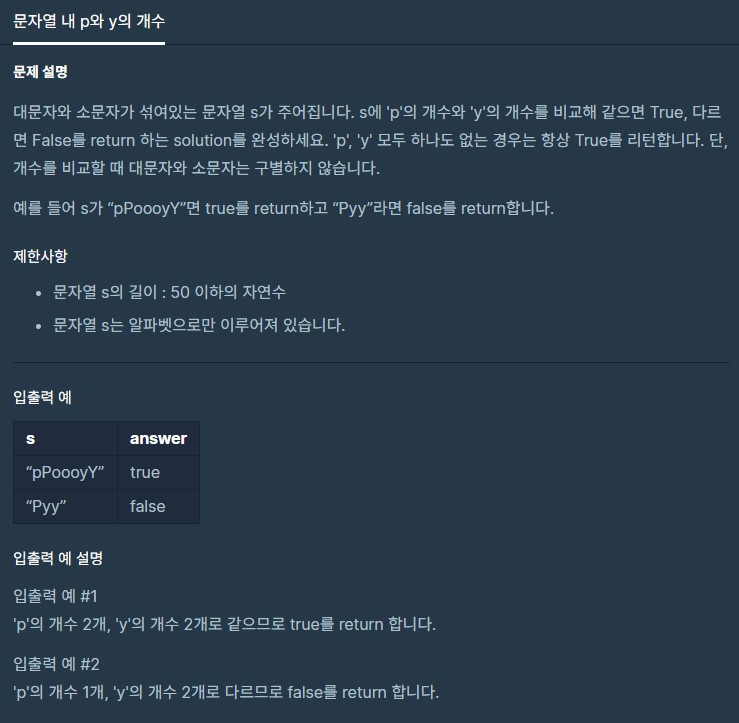

# dailyProblem02



```python
def solution(s):
    cntP = 0
    cntY = 0
    for i in s:
        if i in 'Pp':
            cntP += 1
        elif i in 'Yy':
            cntY += 1
    if cntP == cntY:
        return True
    return False

```

