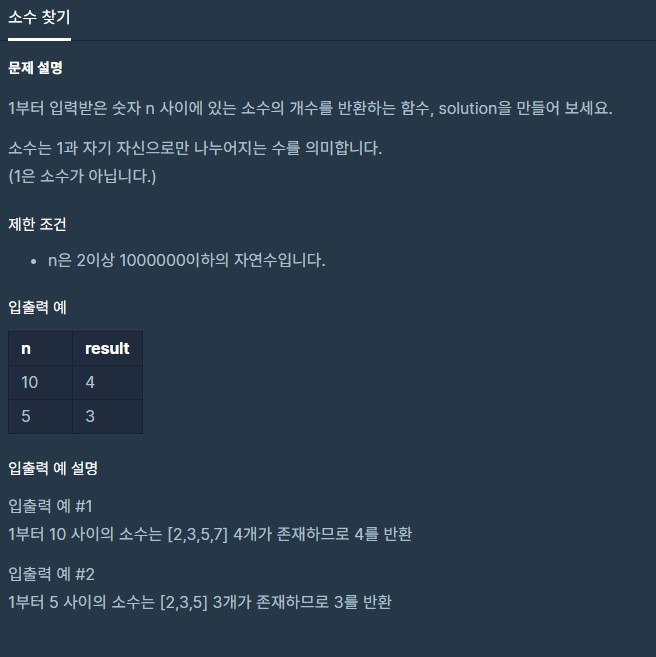

# dailyProblem03



```python
def solution(n):
    answer = 0
    for i in range(2,n+1):
        cnt = 0
        for j in range(2,i+1):
            if i % j == 0 :
                cnt += 1
        if cnt == 1:
            answer += 1
    return answer
```

