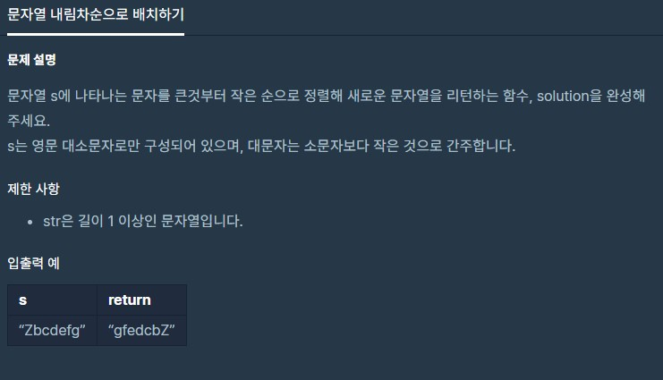

# dailyProblem10



```python
def solution(s):
    answer = ''
    Strings = []
    for i in s:
        if ord(i) > ord('Z'):
            Strings.append(ord(i.lower()) + 0.5)
        else:
            Strings.append(ord(i))
   
    Strings.sort(reverse = True)

    for i in Strings:
        if type(i) == float:

            answer += chr(int(i - 0.5))
        else:
            answer += chr(i)
    print(answer)
    
    
    return answer
```

