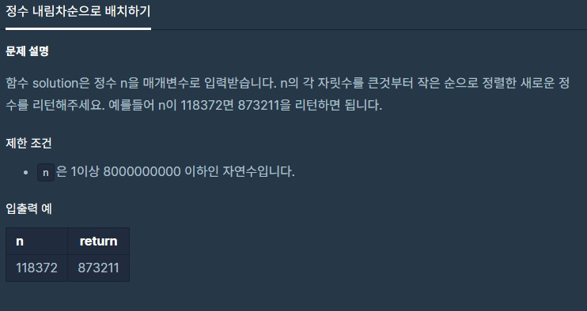

# dailyProblem13



```pythono
def solution(n):
    answer = 0
    numList = []
    word = str(n)
    for i in word:
        numList.append(i)
    
    numList.sort(reverse=True)
    word = ""
    for i in numList:
        word += i
        
    answer = int(word)
    return answer
```

