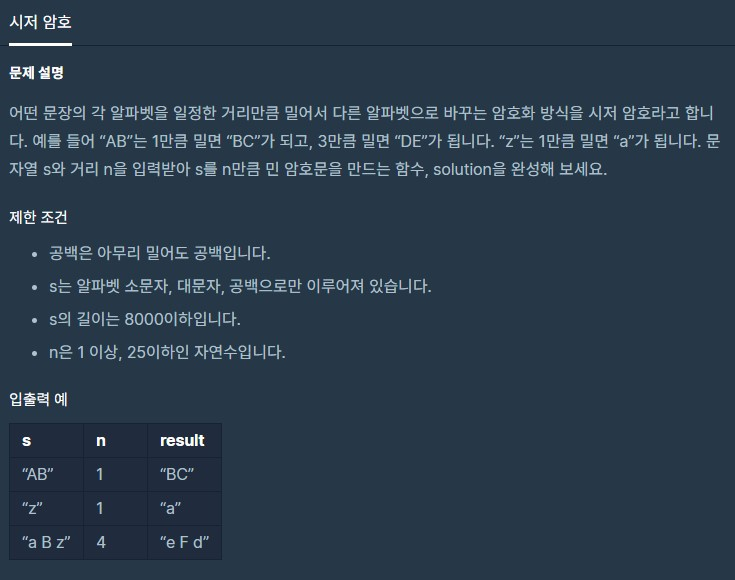

# dailyProblem14



```python
def solution(s, n):
    answer = ''
    dd = [chr(i) for i in range(ord('A'), ord('Z')+1)]
    ss = [chr(i) for i in range(ord('a'), ord('z')+1)]
    for word in s:
        if word != ' ':
            if ord(word) <= ord('Z'):
                idx = (dd.index(word) + n) % 26
                answer += dd[idx]
            else:
                idx = (ss.index(word) + n) % 26
                answer += ss[idx]
        else:
            answer += ' '
            
    return answer
```

