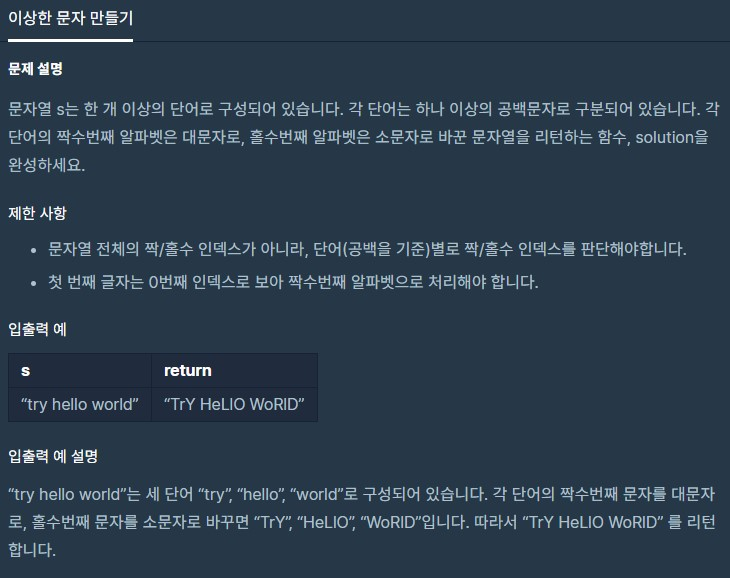

# dailyProblem15



```python
def solution(s):
    answer = ''
    check = 0
    for word in s:
        if word == ' ':
            answer += word
            check = -1
        elif check % 2 == 0:
            answer += word.upper()

        else:
            answer += word.lower()
        check += 1

    return answer
```

