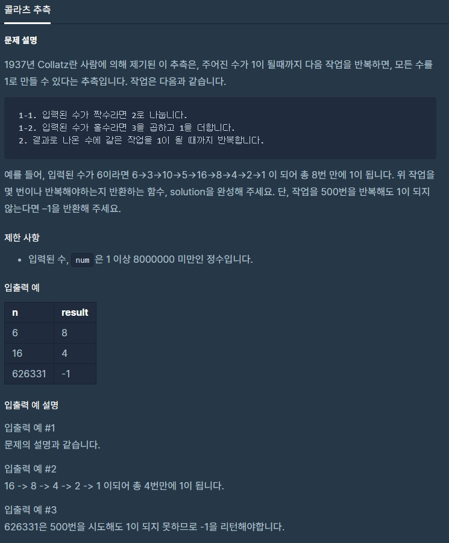

# dailyProblem17



```python
def solution(num):
    answer = 0
    cnt = 0
    while cnt < 500: 
        if num == 1:
            break
        if num % 2 == 0:
            num = num/2
        else:
            num = num*3 + 1
        cnt += 1
    if cnt == 500:
        answer = -1
    else:
        answer = cnt
    return answer
```

