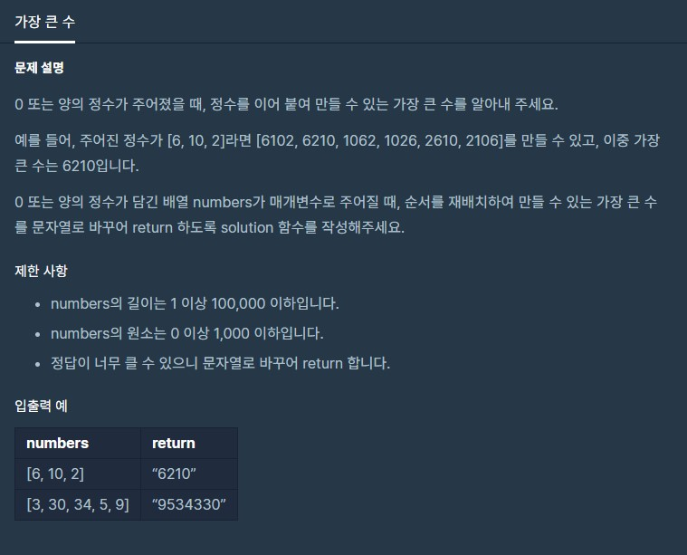

# 가장큰수

출처 : 프로그래머스

https://programmers.co.kr/learn/courses/30/lessons/42746



```python
def solution(numbers):
    # list 의 원소가 모두 0 일 때는 '00000...'이 아니라 '0'을 리턴해야 한다.
    if not sum(numbers):
        return '0'

    sortNumbers = []
    for num in numbers:
        sixNum = str(num)

        if len(sixNum) == 1:
            sixNum = sixNum*6
        elif len(sixNum) == 2:
            sixNum = sixNum*3
        else:
            sixNum = sixNum*2

        sortNumbers.append((sixNum, num))

    sortNumbers = sorted(sortNumbers, reverse=True)
    answer = ''

    # return str(int("".join([item[1] for item in sortNumbers])))

    for a, num in sortNumbers:
        answer += str(num)

    return answer
```

### 다른 풀이

```python
# functools을 쓰는 깔끔한 코드
import functools

def comparator(a,b):
    t1 = a+b
    t2 = b+a
    return (int(t1) > int(t2)) - (int(t1) < int(t2)) #  t1이 크다면 1  // t2가 크다면 -1  //  같으면 0

def solution(numbers):
    n = [str(x) for x in numbers]
    n = sorted(n, key=functools.cmp_to_key(comparator),reverse=True)
    answer = str(int(''.join(n)))
    return answer
```

