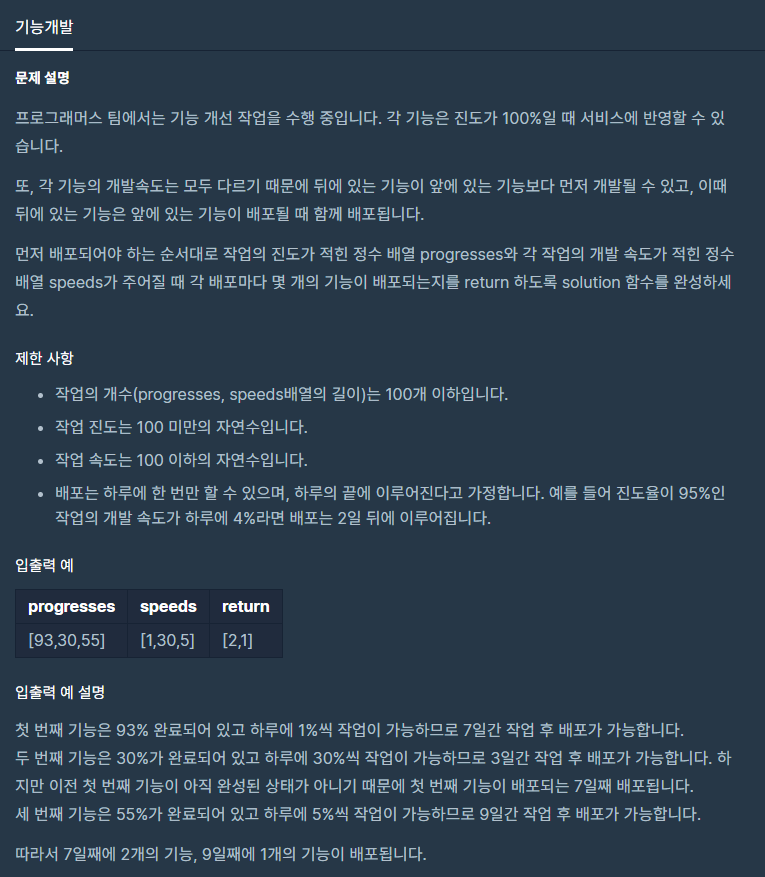

# 기능개발

출처 : 프로그래머스

https://programmers.co.kr/learn/courses/30/lessons/42586



```python
def solution(progresses, speeds):
    result = []

    while progresses:
        cnt = 0
        if progresses[0] >= 100:

            for i in range(len(progresses)):
                if progresses[0] >= 100:
                    progresses.pop(0)
                    speeds.pop(0)
                    cnt += 1
            result.append(cnt)

        for i in range(len(progresses)):
            progresses[i] += speeds[i]

    return result
```

