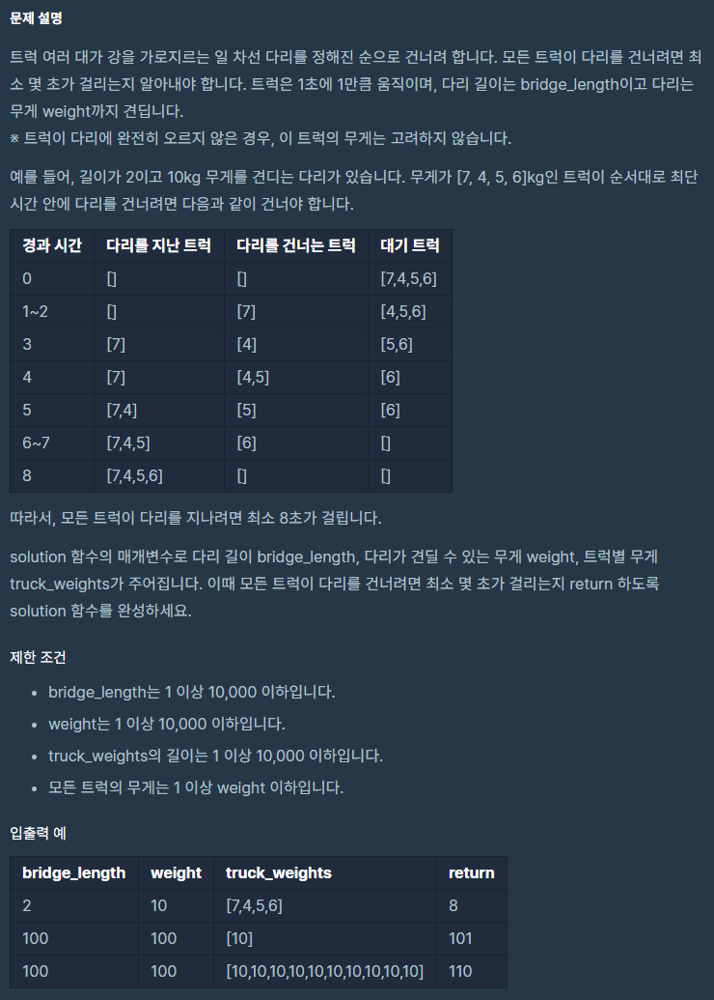

# 다리를지나는트럭

출처 : 프로그래머스

https://programmers.co.kr/learn/courses/30/lessons/42583?language=python3



```python
def solution(bridge_length, weight, truck_weights):
    time = 0
    on_the_bridge = []
    truck_time = []
    while truck_weights or on_the_bridge:
        time += 1

        if truck_time:
            if truck_time[0] == time - bridge_length:
                on_the_bridge.pop(0)
                truck_time.pop(0)
        if truck_weights:
            if truck_weights[0] <= weight - sum(on_the_bridge):
                current = truck_weights.pop(0)
                on_the_bridge.append(current)
                truck_time.append(time)
        
    return time


```

