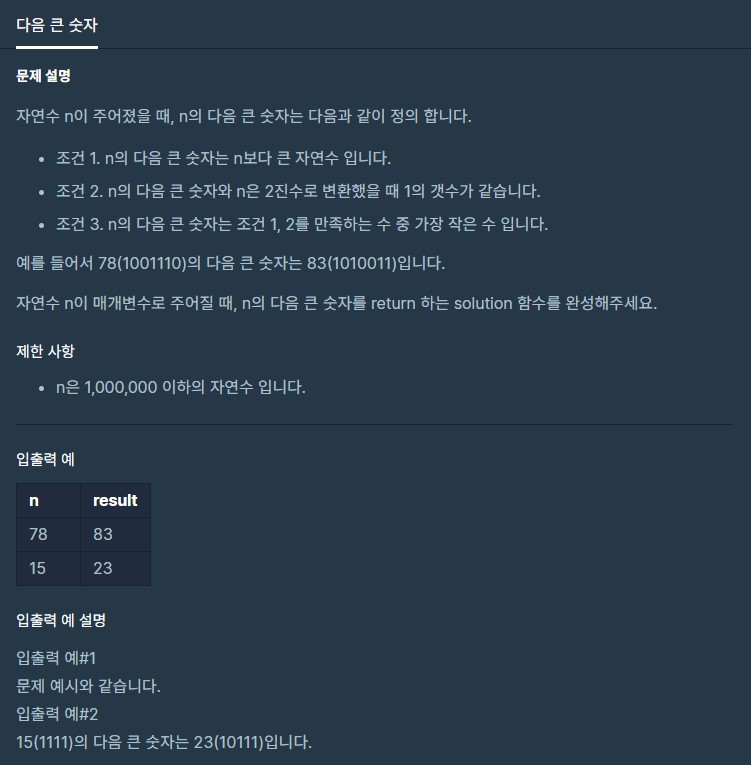

# 다음큰숫자

출처 : 프로그래머스

https://programmers.co.kr/learn/courses/30/lessons/12911?language=python3



```python
def solution(n):
    binaryNumber = []
    num = n
    while True:
        mok = n // 2
        nmg = n % 2
        binaryNumber.append(nmg)

        if mok == 1:
            binaryNumber.append(mok)
            break
        n = mok

    answer = binaryNumber.count(1)

    while True:
        binaryNumber = []
        num += 1
        n = num
        while True:
            mok = n // 2
            nmg = n % 2
            binaryNumber.append(nmg)

            if mok == 1:
                binaryNumber.append(mok)
                break
            n = mok
        answer2 = binaryNumber.count(1)

        if answer == answer2:
            break

    return num
```

