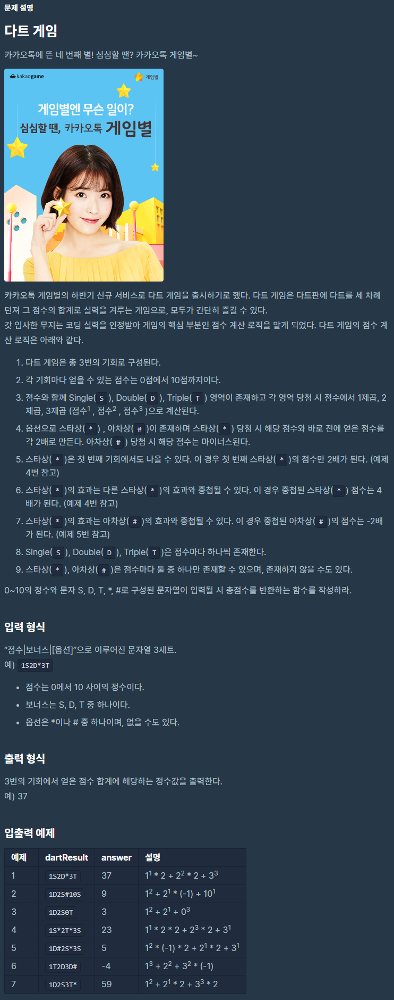

# 다트게임

출처 : 프로그래머스

https://programmers.co.kr/learn/courses/30/lessons/17682



```python
def SDT(sdt):
    answer = 0
    if sdt == 'S':
        answer = 1
    elif sdt == 'D':
        answer = 2
    else:
        answer = 3
    return answer


def bonus(score, prize):
    if prize == '*':
        if len(score) == 1:
            score[0] *= 2
        else:
            score[len(score) - 1] *= 2
            score[len(score) - 2] *= 2

    else:
        score[len(score) - 1] *= (-1)
        
        
def solution(dartResult):
    stack = []
    score = []
    tenCheck = 0
    for idx, i in enumerate(dartResult):
        if idx != len(dartResult) - 1:
            if dartResult[idx] == '1' and dartResult[idx + 1] == '0':
                i = '10'
                tenCheck = 1
        if i == '0' and tenCheck == 1:
            tenCheck = 0
            continue

        if i.isdecimal():
            stack.append(int(i))
        elif i.isalpha():
            score.append(stack.pop() ** SDT(i))
        else:
            bonus(score, i)

    return (sum(score))
```

