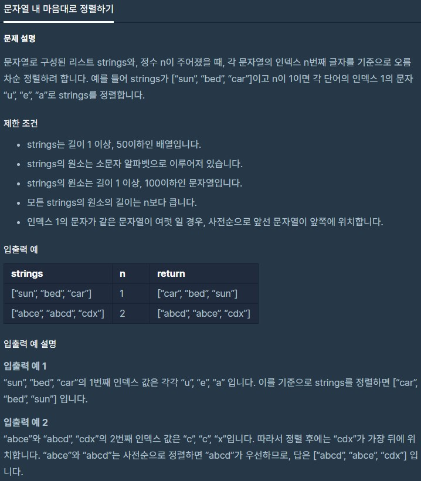

# 문자열내마음대로정렬하기

출처 : 프로그래머스

https://programmers.co.kr/learn/courses/30/lessons/12915



```python
# bubbleSort 활용
def solution(strings, n):
    for i in range(len(strings)-1):
        for j in range(0, len(strings)-i-1):
            if strings[j][n] > strings[j+1][n]:
                strings[j], strings[j+1] = strings[j+1], strings[j]
            elif strings[j][n] == strings[j+1][n]:
                if strings[j] > strings[j+1]:
                    strings[j], strings[j + 1] = strings[j + 1], strings[j]

    print(strings)

    return strings
```

