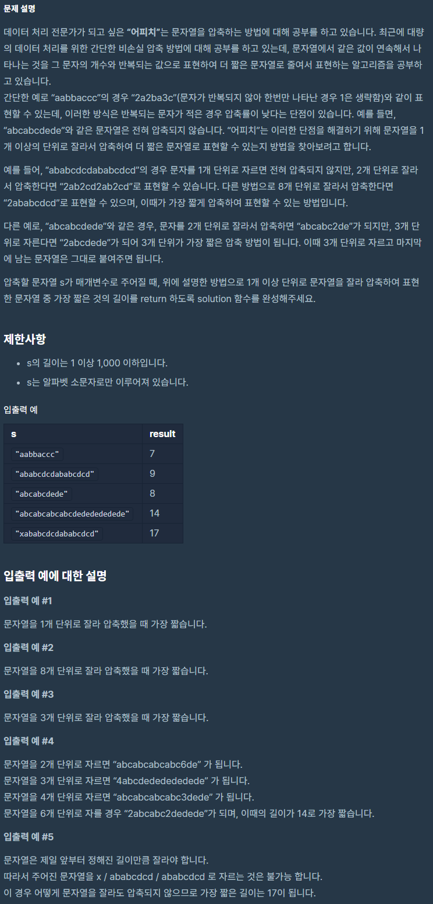

# 문자열압축

출처 : 프로그래머스

https://programmers.co.kr/learn/courses/30/lessons/60057?language=python3



```python
def solution(s):
    if len(s) == 1:
        return 1
    result = []
    for i in range(1, (len(s) // 2) + 1):
        tmp = []
        for j in range(0, len(s), i):
            tmp.append(s[j:j + i])
        tmp.append('')
        result.append(tmp)


    minNum = 1001
    for i in result:
        cnt = 1
        answer = ''
        for j in range(len(i)-1):
            if i[j] == i[j+1]:

                cnt += 1
            else:
                if cnt == 1:
                    answer += i[j]
                else:
                    answer += str(cnt) + i[j]
                cnt = 1
            if len(answer) > minNum:
                break
        if len(answer) < minNum:
            minNum = len(answer)

    return minNum
```

