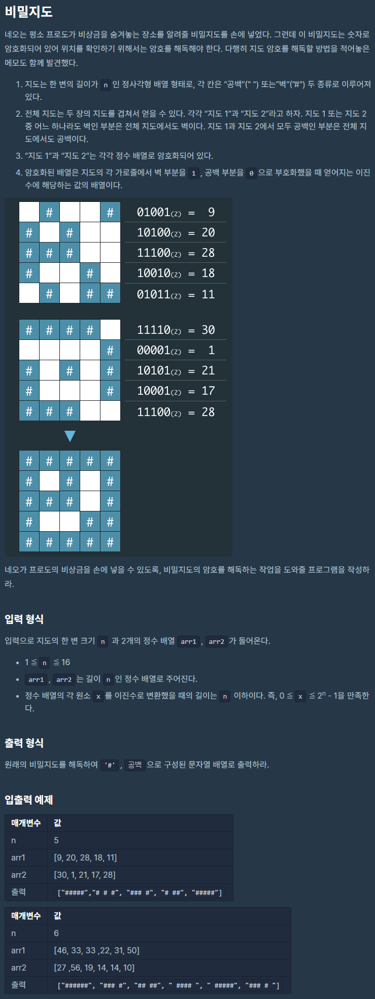

# 비밀지도

출처 : 프로그래머스

https://programmers.co.kr/learn/courses/30/lessons/17681?language=python3



```python
def solution(n, arr1, arr2):
    def ezinMap(num, n):
        tmp = []
        while True:
            mok = num // 2
            nmg = num % 2
            tmp.append(nmg)
            num = mok
            # print(num)
            if num == 1 or num == 0:
                tmp.append(num)
                break
        for i in range(n - len(tmp)):
            tmp.append(0)

        tmp.reverse()
        return tmp

    def makeMap(list1, list2):
        tmp = ''
        for i in range(len(list1)):

            if list1[i] == 0 and list2[i] == 0:
                tmp += ' '
            else:
                tmp += '#'
        return tmp


    lastMap = []
    for i in range(n):
        map1 = ezinMap(arr1[i], n)
        map2 = ezinMap(arr2[i], n)
        answer = makeMap(map1, map2)
        lastMap.append(answer)

    return lastMap
```

