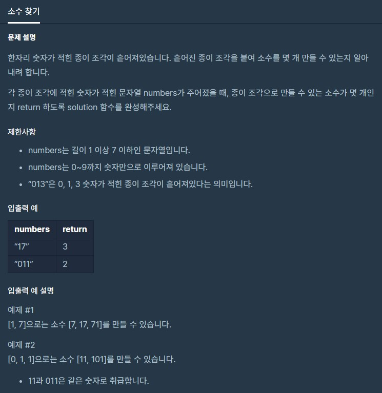

# 소수찾기

출처 : 프로그래머스

https://programmers.co.kr/learn/courses/30/lessons/42839?language=python3



```python
from itertools import permutations

def solution(numbers):
    answer = 0    
        
    # 순열 만들기
    numbers_list = list(numbers)
    number_permu = []
    for i in range(1, len(numbers_list)+1): 
        number_permu += list(map(int, (map(''.join, permutations(numbers_list, i)))))
    
    # 중복 제거
    number_permu = list(set(number_permu)) 
    
    # 소수판별
    for num in number_permu:
        check = True
        if num <= 1:
            continue
        else:
            for i in range(2, num):
                if num % i == 0:
                    check = False
                    break

        if check:
            answer += 1

    return answer
```

