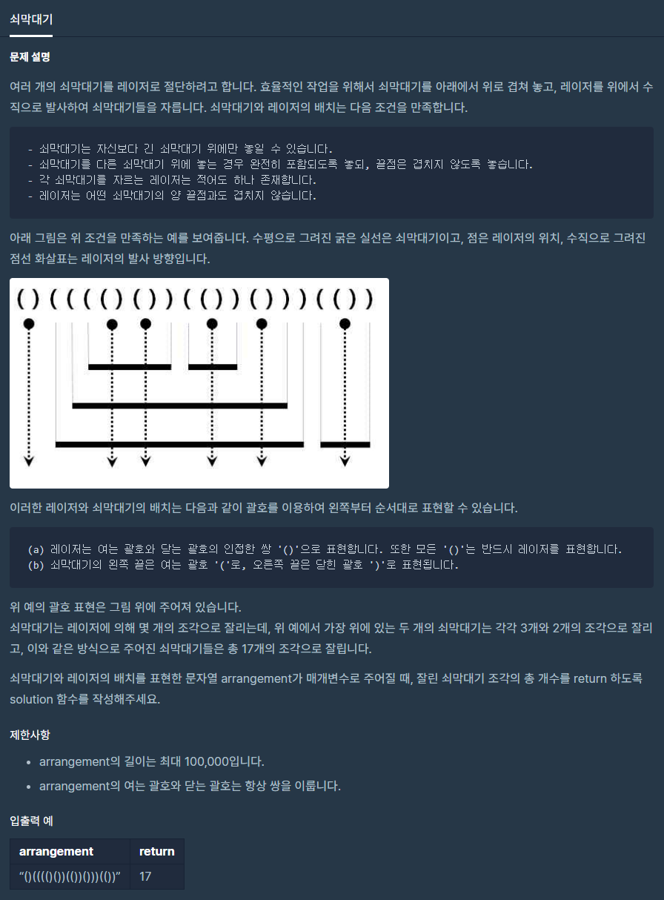

# 쇠막대기

출처 : 프로그래머스

https://programmers.co.kr/learn/courses/30/lessons/42585?language=python3



```python
from _collections import deque
def solution(arrangement):
    q = deque()
    for i in arrangement:
        q.append(i)

    # print(q)
    tmp = deque()
    laser = True
    cnt = 0
    while q:
        current = q.popleft()
        if current is '(':
            laser = True
            tmp.append(current)
        elif current is ')':
            if laser:
                # print('레이저다!!')
                tmp.popleft()
                cnt += len(tmp)
                laser = False
            else:
                # print('마지막조각!!')
                tmp.popleft()
                cnt += 1

    return cnt

```

