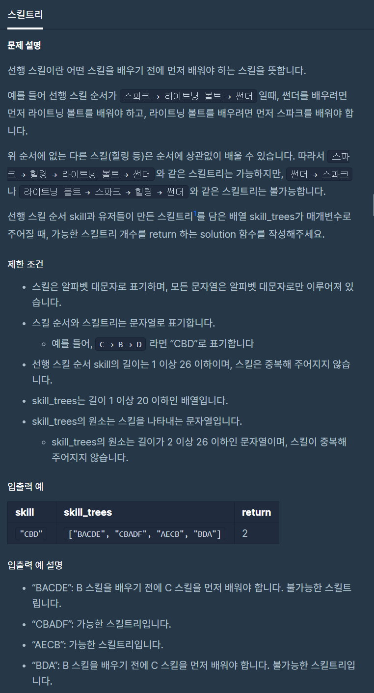

# 스킬트리

출처 : 프로그래머스

https://programmers.co.kr/learn/courses/30/lessons/49993?language=python3#fnref1



```python
def solution(skill, skill_trees):
    def prior_check(new_skill, prior_skill):
        result = ""
        if prior_skill:
            if new_skill in prior_skill:
                if new_skill == prior_skill[0]:
                    prior_skill.pop(0)
                    result = True
                else:
                    result = False
            else:
                result = True
        else:
            result = True
        return result


    prior = []
    cnt = len(skill_trees)
    for i in skill_trees:
        skill_book = []
        for k in skill:
            skill_book.append(k)
        possible_check = True

        for j in i:
            possible_check = prior_check(j, skill_book)
            if possible_check is False:
                cnt -= 1
                break
                
    return cnt
```

