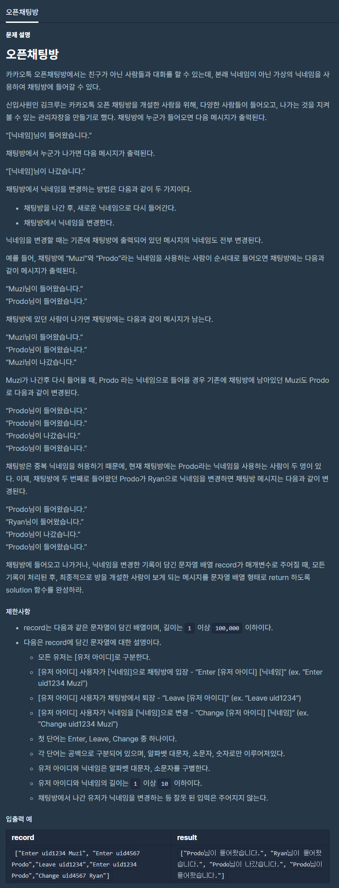

# 오픈채팅방

출처 : 프로그래머스

https://programmers.co.kr/learn/courses/30/lessons/42888?language=python3



```python
def solution(record):
    result = []
    user_info = {}
    for data in record:
        tmp = data.split()
        if len(tmp) == 3:
            action, user_id, nick = tmp[0], tmp[1], tmp[2]
        else:
            action, user_id = tmp[0], tmp[1]

        if action == 'Enter':
            user_info[user_id] = nick
            result.append([nick, '님이 들어왔습니다.', user_id])
            pass
        elif action == 'Leave':
            result.append([nick, '님이 나갔습니다.', user_id])
            pass
        elif action == 'Change':
            user_info[user_id] = nick
            pass

    for i in result:
        i[0] = user_info[i[2]]

    answer = []
    for i in result:
        answer.append(i[0]+i[1])

    return answer
```

