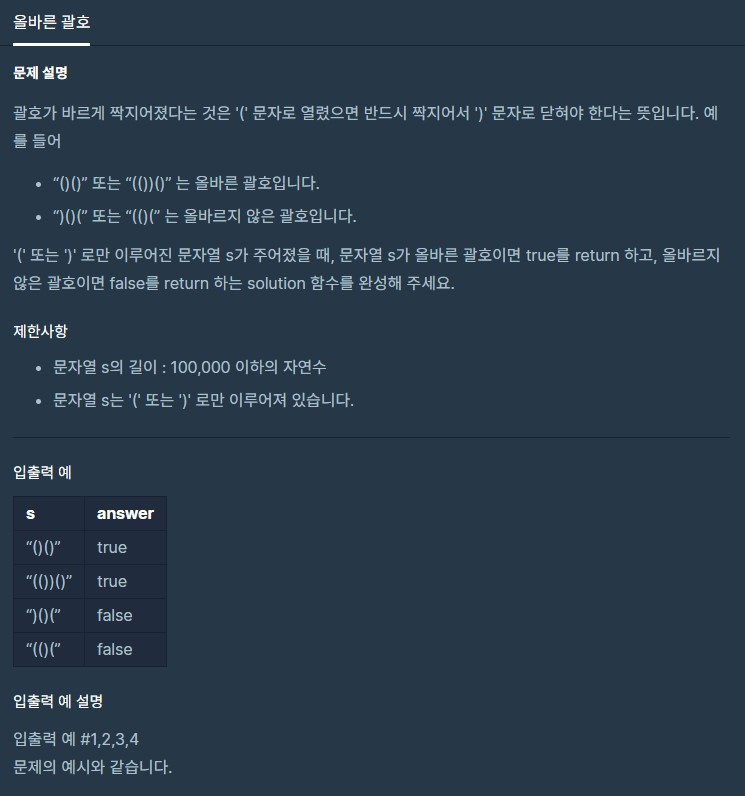

# 올바른괄호

출처 : 프로그래머스

https://programmers.co.kr/learn/courses/30/lessons/12909?language=python3



```python
def solution(s):
    
    stack = []
    for i in s:
        if i == '(':
            stack.append(i)
        else:
            if not stack:
                return False
            else:
                stack.pop()
    if not stack:
        return True
    else:
        return False
```

