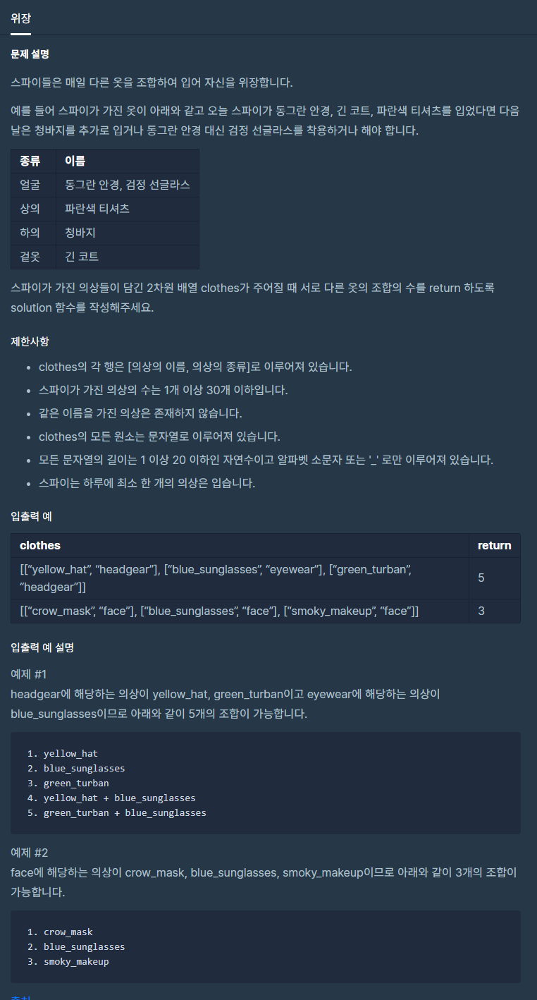

# 위장

출처 : 프로그래머스

https://programmers.co.kr/learn/courses/30/lessons/42578



```python
def solution(clothes):
    clothes_dict = {}
    for cloth in clothes:
        tmp = cloth[1]
        if clothes_dict.get(tmp) is None:
            clothes_dict[tmp] = 2
        else:
            clothes_dict[tmp] += 1

    cnt = 1
    for value in clothes_dict.values():
        cnt *= value

    return cnt - 1
```

