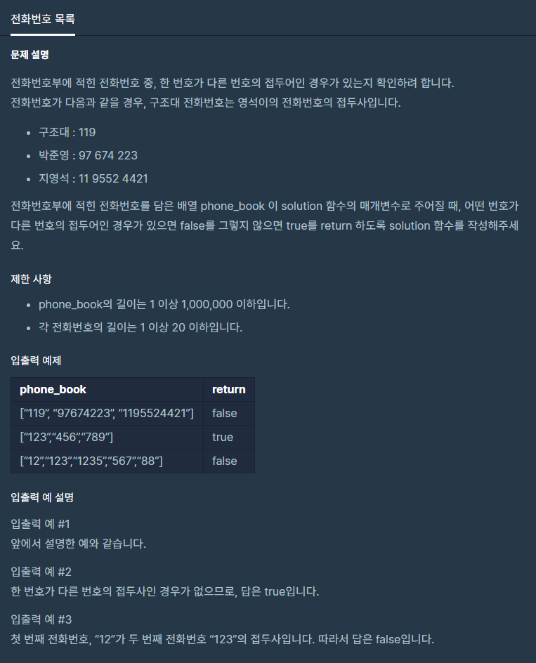

# 전화번호목록

출처 : 프로그래머스

https://programmers.co.kr/learn/courses/30/lessons/42577



```python
def solution(phone_book):
    phone_book_str = list(map(str, phone_book))

    for i in phone_book_str:
        for j in phone_book_str:
            if i is not j and j.startswith(i):
                return False

    return True
```

