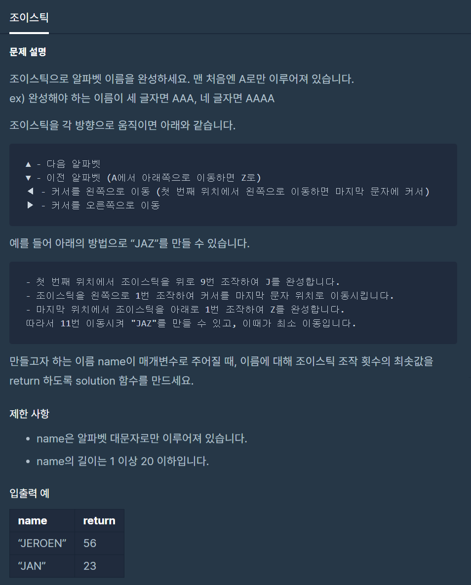

# 조이스틱

출처 : 프로그래머스

https://programmers.co.kr/learn/courses/30/lessons/42860



```python
# 탐욕법을 활용해야 하는 문제이기 때문에, 완전탐색으로 최솟값을 찾는 것은 맞지 않다.
def solution(name):
    name = list(name)
    cnt = 0
    idx = 0


    while True:
        right_idx = 0
        left_idx = 0
        # print('idx', idx)

        if ord(name[idx]) <= ord('N'):
            cnt += ord(name[idx]) - ord('A')
            print(name[idx])
        else:
            cnt += ord('Z') - ord(name[idx]) + 1
            print(name[idx])

        name[idx] = 'A'
        # print('상하', cnt)

        if len(set(name)) == 1 and 'A' in name:
            break
        for i in range(1, len(name)//2+1):
            if name[idx + i] == 'A':
                right_idx += 1
            if name[idx - i] == 'A':
                left_idx += 1

            if right_idx > left_idx:
                idx = idx - i
                cnt += i
                break
            elif left_idx > right_idx:
                idx = idx + i
                cnt += i
                break
            elif right_idx == 0:
                idx = idx + 1
                cnt += 1
                break
        else:
            idx += 1
            cnt += 1

        # print('좌우', cnt)
    return cnt


# print(solution('BBAABB'))
```

