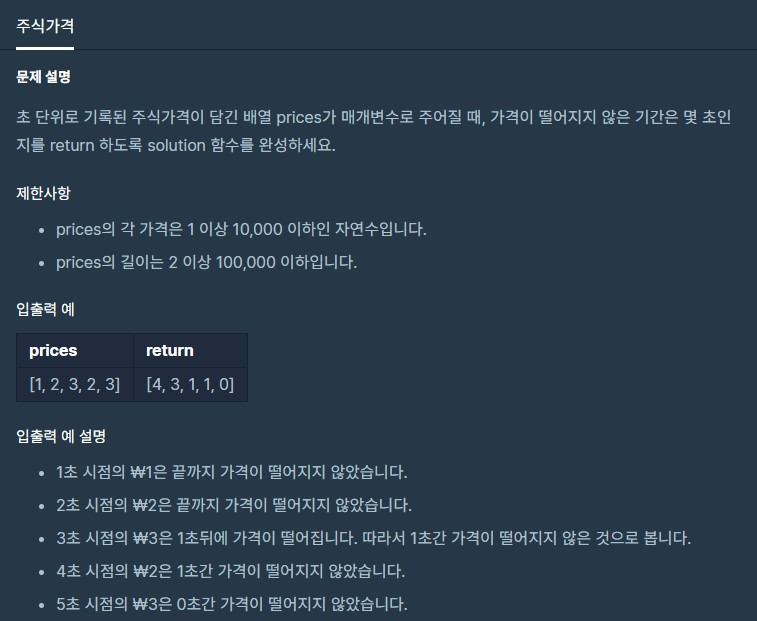

# 주식가격

출처 : 프로그래머스

https://programmers.co.kr/learn/courses/30/lessons/42584



```python
def solution(prices):
 
    answer = []
    for idx, price in enumerate(prices):
        cnt = 0
        current = prices[idx]
        tmp = 0
        for i in range(idx + 1, len(prices)):
            cnt += 1

            if prices[i] < current:
                break


        answer.append(cnt)
    return answer
```

