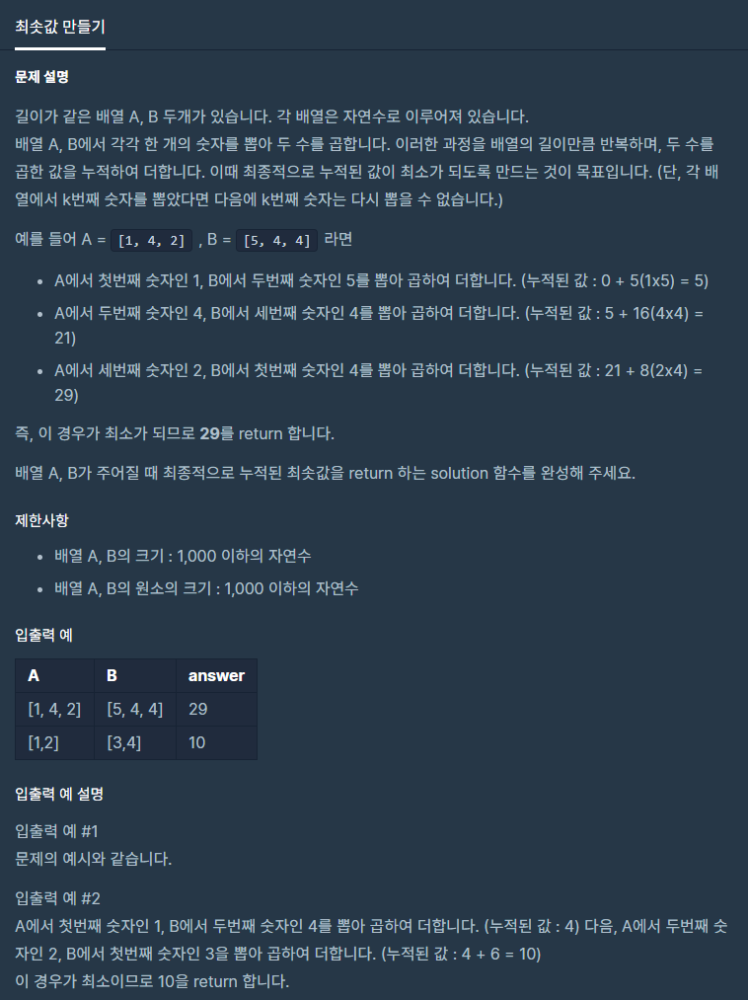

# 최솟값만들기

출처 : 프로그래머스

https://programmers.co.kr/learn/courses/30/lessons/12941?language=python3



```python
def solution(A,B):
    answer = 0
    
    A.sort()
    B.sort(reverse=True)
    
    for i in range(len(A)):
        answer += A[i] * B[i]

    return answer
```

