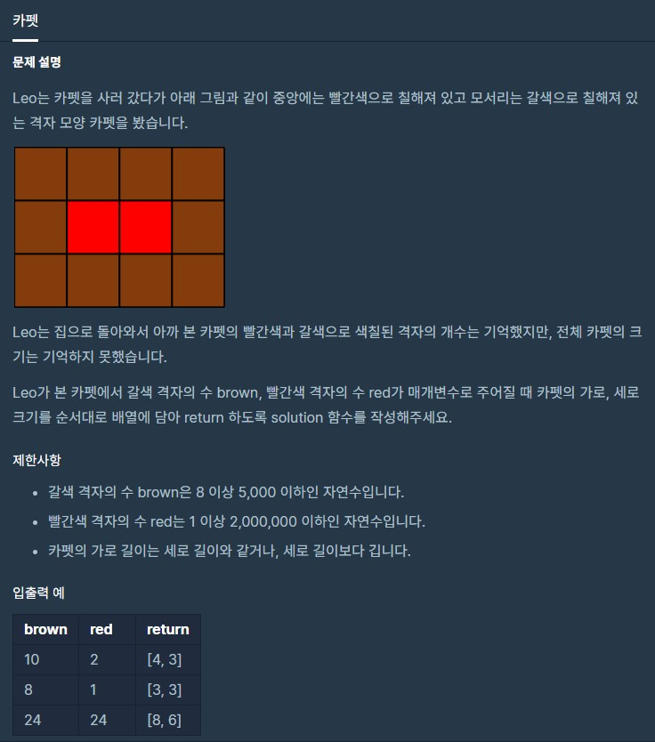

# 카펫

출처 : 프로그래머스

https://programmers.co.kr/learn/courses/30/lessons/42842?language=python3



```python
def solution(brown, red):
    answer = []
    
    center = []
    for i in range(1, red+1):
        if red % i == 0:
            if red//i >= i:
                center.append([red//i, i])

    # print(center)
    for i in center:
        result = (i[0] + 2) * 2 + (i[1] * 2)
        if result == brown:
            # print(i[0] + 2, i[1] + 2)
            answer.append(i[0] + 2)
            answer.append(i[1] + 2)

    return answer
```

