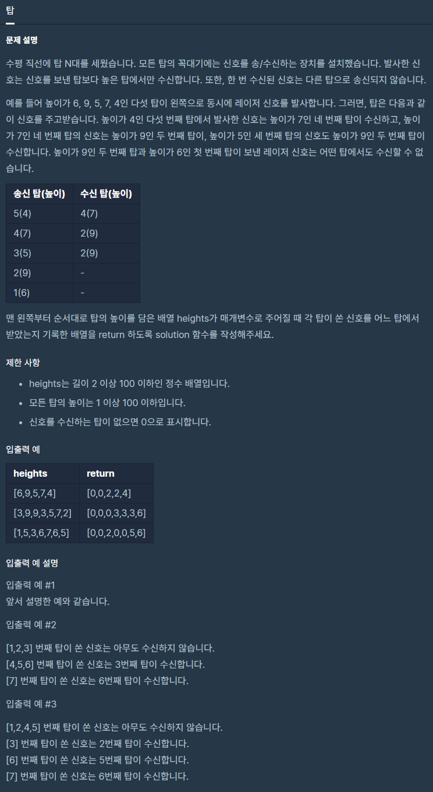

# 탑

출처 : 프로그래머스

https://programmers.co.kr/learn/courses/30/lessons/42588



```python
def solution(heights):
    answer = []
    for i in range(len(heights)):
        if i == 0:
            answer.append(i)
        else:
            check = 1
            for j in range(i-1, -1, -1):
                print(heights[j],j, '     ', heights[i],i)
                if heights[j] > heights[i]:
                    answer.append(j+1)
                    check = 1
                    break
                else:
                    check = 0
            if check == 0:
                answer.append(0)

    return answer
```

