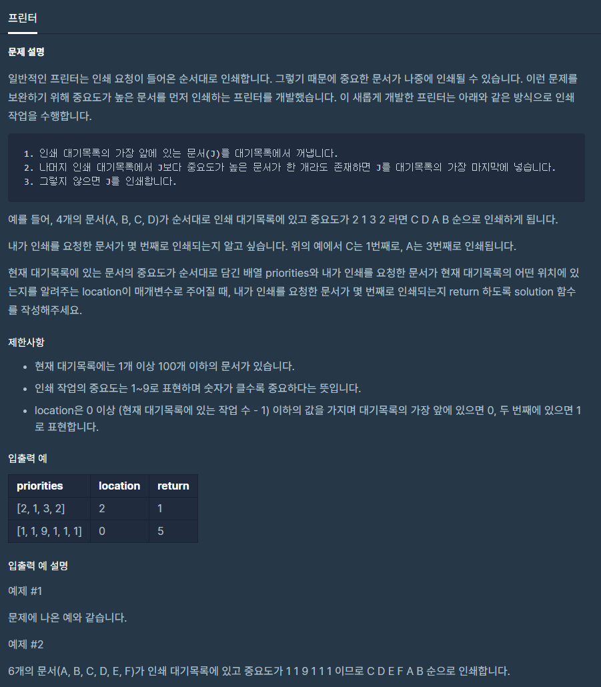

# 프린터

출처 : 프로그래머스

https://programmers.co.kr/learn/courses/30/lessons/42587?language=python3



```python
def solution(priorities, location):
    idxes = [_ for _ in range(len(priorities))]
    printed = []
    answer = 1
    
    while priorities:
        idx, current = idxes.pop(0), priorities.pop(0)
        
        if priorities:
            if max(priorities) > current:
                priorities.append(current)
                idxes.append(idx)
            else:
                if idx == location:
                    answer = len(printed) + 1
                    break
                else:
                    printed.append(idx)
        else:
            answer = len(printed) + 1

    return answer

```

