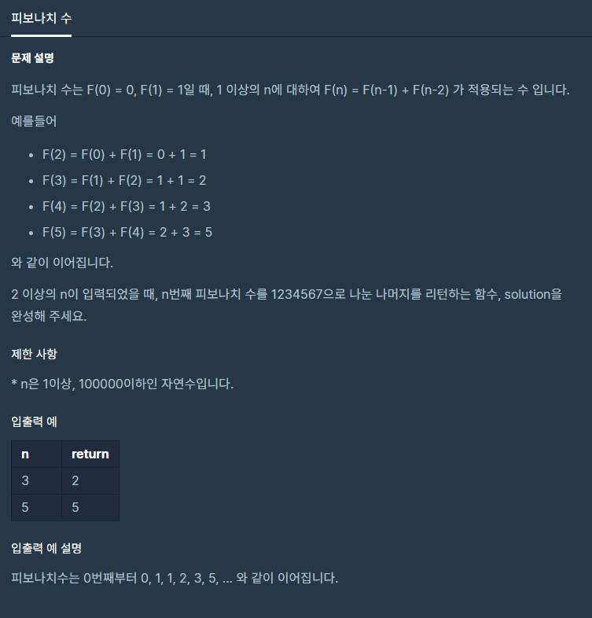

# 피보나치수

출처 : 프로그래머스

https://programmers.co.kr/learn/courses/30/lessons/12945



```python
def solution(n):

    f = [0]*(n+1)
    def fibo_dp(n):
        f[0] = 0
        f[1] = 1
        for i in range(2, n+1):
            f[i] = f[i-1] + f[i-2]
            
        return f[n]
    
    return fibo_dp(n)%1234567
```

